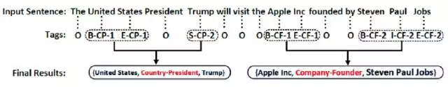

# A survey of comparative opinion mining (“比较观点挖掘”调研)

比较句作为常见的表达方式，有助于评论这更加立场鲜明的表达自己的观点。而有效的识别出比较句的信息，可为消费者和商家决策提供技术支持。而比较句观点挖掘，是综合语言学，机器学习和自然语言处理的研究，涉及文本分类，实体提取，观点挖掘和情感分析等领域。这些领域都有一定的进展，但由于比较句自身的特殊和复杂，目前其研究仍然处于探索阶段。（此调研主要基于同济大学王洪伟的关于比较句的综述，包括刚刚的介绍，建议配合原文阅读）

以下主要介绍比较句的相关研究以及我们之前所做的实验：
- 比较句观点挖掘介绍
- 比较句识别（我们的工作）
- 比较关系抽取（我们的工作）

refer:
- [面向在线评论的比较观点挖掘研究综述](https://www.researchgate.net/publication/317132492_mianxiangzaixianpinglundebijiaoguandianwajueyanjiuzongshu)

## 比较句观点挖掘介绍
- 此处主要见 [面向在线评论的比较观点挖掘研究综述](https://www.researchgate.net/publication/317132492_mianxiangzaixianpinglundebijiaoguandianwajueyanjiuzongshu)

## 比较句识别
- 原理：在比较句识别上，我们使用了和[文灵](https://github.com/yimian/wenling)一样的 LSTM + Word2Vec 模型，将其改为二分类。
- 语料：COAE2013 的电子商品和汽车的 2000 条语料（1000 条是比较句，1000 条不是）。
- 结果：可以得到 0.96 左右的准确率和召回率。具体见：[result](./data/result/5_fold_result.txt)。
- 优点：准确率和召回率都较高，且无需特征工程，可快速得到模型。
- 缺点：我们将从 COAE2013 训练出来的模型，用来预测电商评论，发现泛化能力不足。（主要原因是电商评论中有许多语句形式与训练语料差异过大，如“好评”，“差评”）

## 比较关系抽取
- 原理：比较关系抽取也属于关系抽取的任务，而对于关系抽取任务，有一种解决方案是将其转换成序列标注任务（附图[1]）。转换成序列标注任务后，有许多模型可用来解决这一问题，从简单到复杂有：hmm，crf，LSTM + CRF 等等。我们进行了最基础的 hmm 的尝试。
- 语料：我写了个脚本将 COAE2013 中的汽车语料按 "t" --> 比较实体，"a" --> 比较层面， "o" --> 其他 的方式进行了标记，具体见：[car_label](./data/car_label.txt) 
- 结果：结果在召回率上表现得不理想。在比较实体("t")，比较层面("a")和其他("o")上的准确率都为百分之九十多，在召回率上，因为比较层面("a")的样例在语料中出现得极少（只有一千个左右），其召回率只有 0.1，而比较实体的召回率为 0.5 左右，其他的召回率为 0.9+。具体数据见: [result](./code/hmm_label.py) 的注释部分。
- refer:
    - https://mp.weixin.qq.com/s?__biz=MzIwMTc4ODE0Mw==&mid=2247484839&idx=1&sn=e2604c9104432d8719c57cf5bb44f1ca&chksm=96e9da27a19e5331be6c9f7e277e04586f8584b3369d6085552f23a9b06237c873be47e24312&scene=21#wechat_redirect

- 附图：
    - [1] 
