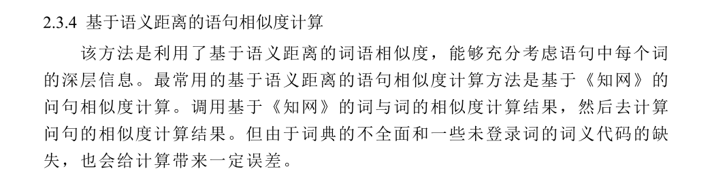
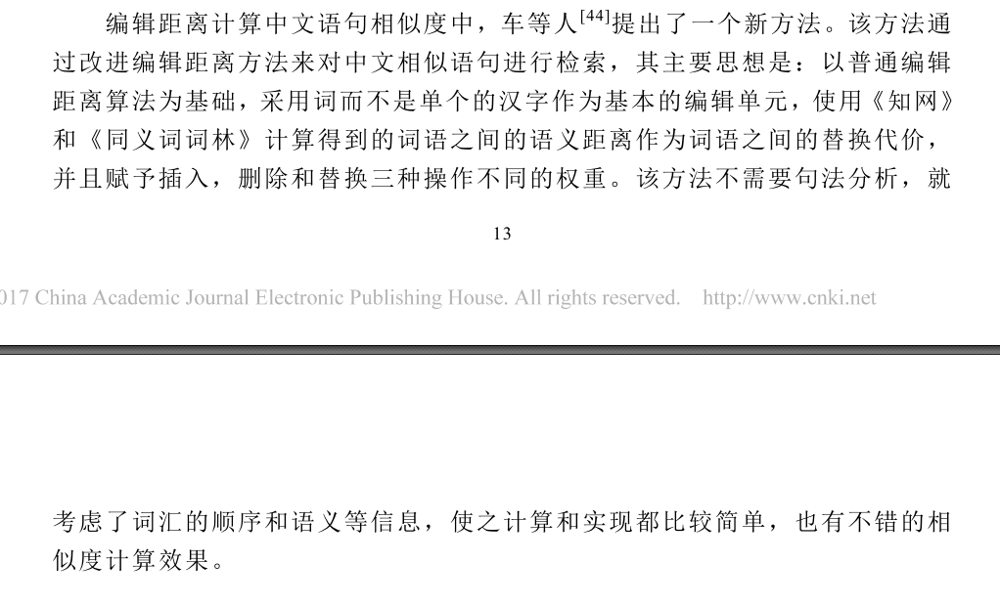

# A survery of question similarity (“问句相似度”调研)

在问答系统中，经常会将常见的问题和答案储存起来构成常见问题集（FAQ：frequently asked question）。当有新问题来到时，可将其与 FAQ 中的问题进行匹配，并返回相似度最高的问题的答案，其中一个关键的步骤就是问题相似度的计算。（这个调研主要是对合肥工业大学强继朋的硕士论文的总结和归纳，建议配合原文阅读）

以下主要介绍句子相似度计算的四种方法，以及对应的优缺点:  
- 基于向量空间模型的 tf-idf 方法 (基于关键词信息模型的方法)
- 基于语义依存的语句相似度计算
- 基于语义距离的语句相似度计算
- 基于编辑距离的语句相似度计算

refer:
- http://www.arocmag.com/article/01-2014-04-032.html
- http://gb.oversea.cnki.net/KCMS/detail/detail.aspx?filename=1013378167.nh&dbcode=CMFD&dbname=CMFD2014

### 基于向量空间模型的 tf-idf 方法
- 原理：  
    - 

### 基于语义依存的语句相似度计算
- 原理：
    - 

### 基于语义距离的语句相似度计算
- 原理：
    - 

### 基于编辑距离的语句相似度计算
- 原理 （在这里提供了一种新方法，不是基于字，而是基于词和知网以及同义词词林来做）：
    - 

### 效果对比
- 

---
以上四种办法是传统的，对于普通的陈述句计算相似度的常用方法。在这个 survey 的主要参考论文中（FAQ问答系统中的问句相似度研究)，作者提出了两种针对问句计算相似度的算法：

- 基于问句特征的问句相似度计算
- 基于词语褒贬倾向的问句相似度计算  

### 基于问句特征的问句相似度计算
- 原理：  
    - 见 FAQ问答系统中的问句相似度研究 15 到 25 页
- 优点：
    -   引入了问句特征（问句类别和句型），从而提高了相似度计算的准确性
- 缺点：
    - 需要对问句类型进行预分类，增加了工作量，而且这个环节也有出错的可能性

### 基于基于词语褒贬倾向的问句相似度计算
- 原理： 
    - 见 FAQ问答系统中的问句相似度研究 26 到 33 页
- 优点：
    - 引入了关键词的褒贬情感，能将情感倾向纳入相似度计算当中
- 缺点：
    - 有时候情感极性相反，但是主题一致的问句会被排除在外

### A Simple but Tough-to-beat Baseline for Sentence Embeddings
- 简介：  
    - 这篇论文提出了一种在词向量的基础上用一种无监督的方式来表征句向量的思路。
- details:
    - 
- 优点：  
    - 无监督，不需要标注数据
    - 易实现，计算量小
    - 效果好（在作者的实验上，用此方法来表征句向量，在各种任务中普遍能提高 10% -30% 的效果）
- 缺点：
    - 可解释性弱
- source:  
    - https://openreview.net/pdf?id=SyK00v5xx

- code:  
    - https://github.com/PrincetonML/SIF

- refer:  
    - https://web.stanford.edu/class/cs224n/lectures/cs224n-2017-lecture2-highlight.pdf
    - https://www.youtube.com/watch?v=BCsOrewkmH4

### Word Embeddings To Document Distances
- 简介：  
    - 这篇论文提出了一种通过词向量来计算文档之间距离的方式。

- details:
    - 

- 优点：
    - 可解释性强
- 缺点：
    - 计算量大

- source：
    - https://chara.cs.illinois.edu/sites/fa16-cs591txt/pdf/Kusner-2015-ICML.pdf

- code：  
    - https://github.com/mkusner/wmd

- refer：
    - https://www.zhihu.com/question/33952003/answer/134691643