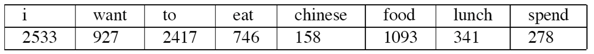

# A survey of spelling correction (“拼写纠错”调研)

拼写纠错属于“查询理解”方向的问题。

查询理解通常是搜索引擎中重要的的一步，目的是正确地提取出用户查询中的语义，优化用户的查询体验，随着智能 QA (Question answering) 系统的出现，它也成为各个 QA 系统的核心，诸如 Amazon Alexa, Apple's Siri 等等。

查询理解的相关技术有：

- 拼写纠错
- 查询建议
- 查询重写（也有人将拼写纠错划入查询重写）
    - 同义词替换
    - 关联查询

refer:
- http://blog.csdn.net/zhoubl668/article/details/7857756
- https://www.zhihu.com/question/20681002
- http://www.infoq.com/cn/articles/user-search-intention-recognition#

以下是拼写纠错技术的资料。

## 拼写纠错

- 基于词库
    - 基于汉字的拼音
    - 基于汉字的编辑距离
    - 基于汉字拼音的编辑距离
- 利用统计模型进行拼写错误识别

refer：
- http://www.datagrand.com/blog/search-query.html
- http://www.voidcn.com/article/p-eqewptbd-tq.html
- https://my.oschina.net/keyven/blog/516808
- http://history.ccf.org.cn/sites/ccf/xhdtnry.jsp?contentId=2847449639353

paper:
- http://www.aclweb.org/anthology/W15-3120
- http://www.aclweb.org/anthology/W15-3107
- http://www.aclweb.org/anthology/W14-6835

projects:
- https://code.csdn.net/helihongzhizhuo/wordfind
- https://github.com/ccheng16/correction
- https://github.com/dreamcity/ChineseCorrection
- https://github.com/bnusss/Neural_Language_Correction
- https://github.com/lx865712528/LM-CNLC

### 基于词库
- 原理:
建立查询词词库, 对查询词在词库中进行匹配，若匹配中则不做处理。不完全匹配的话，从词库中选择适当的词返回给用户（建立查询词词库的时候可对用户的查询日志进行统计，将其高频词加入词库）。
而如何根据查询词来从词库中选择相应的词，可以借助拼音，也可以借助汉字编辑距离，也可以借助拼音的编辑距离（当前thiqa 项目采用的方式）。

#### 基于汉字的拼音
- 原理：
    - 把搜索的词还原成拼音，用一个拼音相同的已知的常用搜索词去代理。

- 优点：
    - 这是一个很经典的纠错策略，能很好地针对最常见的由于同音字造成的拼写错误进行纠错，也是美团采用的策略。（美团的技术分享见： https://tech.meituan.com/pinyin-suggest.html）
- 缺点：
    - 当输错的词有多音字的时候，同音词替换的搜索空间会很大。当其中包含多个多音字的时候，搜索空间是指数扩大的。

#### 基于汉字的编辑距离（注意：这个也可以用来做寻找相似问句）
- 原理：
    - 编辑距离，又称 Levenshtein 距离（也叫做 Edit Distance），是指两个字串之间，由一个转成另一个所需的最少编辑操作次数，如果它们的距离越大，说明它们越是不同。许可的编辑操作包括：将一个字符替换成另一个字符，插入一个字符，删除一个字符。  
    - 将其用于拼写纠错就是在已知的搜索词中寻找编辑距离与用户输入词最小的词。其实现见：http://norvig.com/spell-correct.html  
    以及：http://codepub.cn/2015/07/07/Python-implementation-string-similarity-edit-distance/

- 优点：
    - 纠错速度极快，算法复杂度极低

- 缺点：
    - 对于汉字来说，无法考虑两个汉字在拼音上的相似性。

#### 基于汉字拼音的编辑距离 （当前 thiqa 项目采用的方式）
- 原理：
    - 把查询词和词库中的词都转换成拼音，比较二者的编辑距离，若编辑距离在一定范围内则选择替换
- 优点：
    - 能很好的捕获最为常见的汉字拼写错误

### 统计模型在拼写纠错中的应用
- 原理：  
n-gram 模型是基于如下假设的：对正确的语言现象，词与词之间共现概率较高。对不符合语法的错误语言，词与词之间的共现概率较低。而一个句子 (Sentence) 的概率的计算方法如下：  
P(s) = P(w1, w2, ......, wn) = P(w1) * P(w2 | w1) * ...... * P(wn | w1, w2, ..., wn-1)  
当 n = 1 时，模型简化为:
P(s) = P(w1) * P(w2) * ...... * P(wn)  
当 n = 2 时，模型简化为：
P(s) = P(w1) * P(w2 | w1) * P(w3 | w2) * ...... * P(wn | wn-1)  
......  
平时最常用的为 2-gram 模型。下面用一个例子展示一下它的具体计算：  
对于一个数据集，假设 count（wi）统计如下（总共 8493 个单词）：  
  
而 count（wi, wi-1）统计如下：  
  
则 2-gram 概率矩阵计算如下：  
  
句子 “I want to eat Chinese food” 成立的概率为：  
P(I want to eat Chinese food) = P(I) * P(want|I) * P(to|want) * P(eat|to) * P(Chinese|eat) * P(food|Chinese)
 = （2533/8493) * 0.33 * 0.66 * 0.28 * 0.021 * 0.52。

- 应用：  
    - 基于 n-gram 对句子进行拼写错误检查：  
    可设定一定长度的窗口：比如词长为 5. 用该窗口扫描句子，若发现某部分的 P(s) 低于阈值，则该部分可能存在拼写错误。该阈值为经验阈值（我认为也可以通过从正确的预料中计算出来）。
    - 基于 n-gram 从候选词中挑选出最适合的词：  
    在之前的方法中介绍了通过拼音和编辑距离两种方式来从词库中挑选出用于纠错词的候选词，比如用编辑距离的方式，绝大部分的错误词与正确词的编辑距离在 2 以内。那么当从词库中选取了所有的候选词之后，可用 n-gram 模型对候选词排序，即将其挨个代入 n-gram 模型，使 P(s) 越大的词越佳。

- refer:  
    - https://my.oschina.net/keyven/blog/516808
    - http://blog.csdn.net/qq_35082030/article/details/72981400
    - http://www.52opencourse.com/138/%E6%96%AF%E5%9D%A6%E7%A6%8F%E5%A4%A7%E5%AD%A6%E8%87%AA%E7%84%B6%E8%AF%AD%E8%A8%80%E5%A4%84%E7%90%86%E7%AC%AC%E4%BA%94%E8%AF%BE-%E6%8B%BC%E5%86%99%E7%BA%A0%E9%94%99%EF%BC%88spelling-correction%EF%BC%89
    - https://wenku.baidu.com/view/efafce1fc5da50e2524d7ffe.htmlhttps://wenku.baidu.com/view/efafce1fc5da50e2524d7ffe.html

